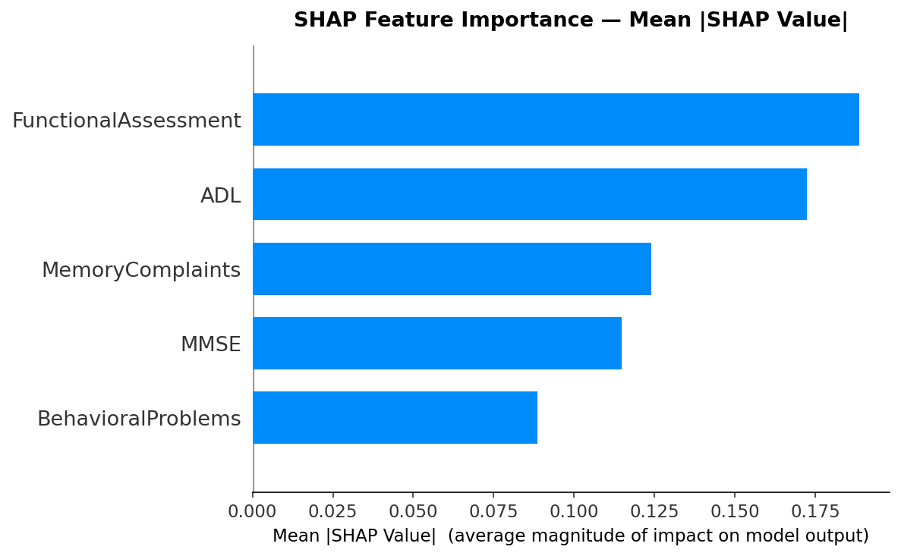
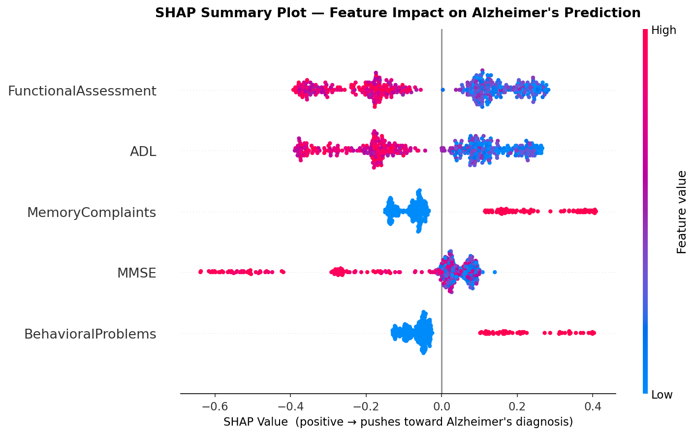
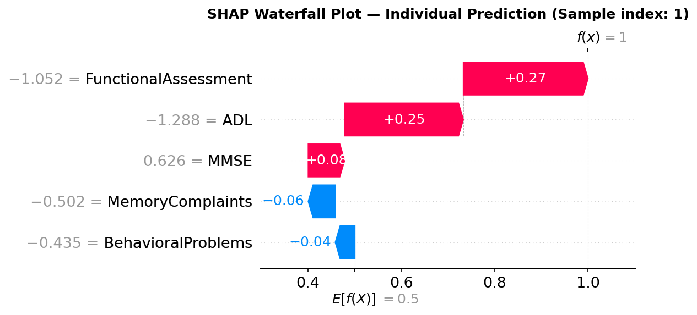

# 🧠 Alzheimer's Disease Prediction and Comprehensive Data Analysis Using Machine Learning


> **Final Project** — Big Data Analytics Course, December 2025  
> Department of Computer Science and Information Engineering, NDHU  
> Advised by **Prof. Chung Yung** & TA **Demiah Kisla Charlery**  
> **Author:** [Supharada Jundok](https://mato8q.github.io/imnotmato8q.github.io/)

---

## 📌 Overview

This project applies machine learning techniques to predict Alzheimer's disease diagnosis from structured clinical data. The analysis covers the full pipeline — from exploratory data analysis and feature selection to multi-model comparison, evaluation, and SHAP-based explainability.

**Key result:** Random Forest achieved **96.74% test accuracy** and **97.48% ROC-AUC**, outperforming 10 other classifiers.

🌐 **Live Showcase:** [View Project Website](https://mato8q.github.io/Alzheimer_s_Disease_PredictionNComprehensive_Data_Analysis_Using_ML)  
📓 **Notebook (with SHAP):** [View on GitHub](https://github.com/mato8q/Alzheimer_s_Disease_PredictionNComprehensive_Data_Analysis_Using_ML/blob/ef1b53ca2b688feef00c67cd2f2427ef342ac537/alzheimer_with_shap.ipynb)

---

## 📊 Dataset

| Property | Value |
|---|---|
| Source | [Alzheimer's Disease Dataset — Kaggle](https://www.kaggle.com/datasets/rabieelkharoua/alzheimers-disease-dataset) |
| Total samples | 2,149 patients |
| Non-Alzheimer (0) | 1,389 samples (64.6%) |
| Alzheimer (1) | 760 samples (35.4%) |
| Total features | 35 columns |
| Selected features | 5 (post-EDA) |

**Class imbalance** was handled via `class_weight='balanced'` for tree-based models and `scale_pos_weight` for XGBoost/LightGBM.

---

## 🔬 Selected Features

Chosen through correlation analysis, t-tests, chi-square tests, and Spearman correlation:

| Rank | Feature | Type | Gini Importance |
|---|---|---|---|
| 1 | `FunctionalAssessment` | Continuous | 0.35 |
| 2 | `ADL` | Continuous | 0.22 |
| 3 | `MMSE` | Continuous | 0.15 |
| 4 | `MemoryComplaints` | Binary | 0.08 |
| 5 | `BehavioralProblems` | Binary | 0.05 |

---

## ⚙️ Project Pipeline

```
Dataset Acquisition
      ↓
Data Exploration & Cleaning   (missing values, distributions)
      ↓
Exploratory Data Analysis     (boxplots, t-tests, chi-square, correlation)
      ↓
Feature Selection             (5 features selected)
      ↓
Machine Learning Modeling     (11 models, sklearn Pipeline, StandardScaler)
      ↓
SHAP Explainability           (beeswarm, bar, waterfall plots)
```

---

## 🤖 Models Compared

11 classifiers were evaluated using an sklearn `Pipeline` with `StandardScaler` preprocessing:

| Model | Test Accuracy | F1 (Alzheimer's) | CV Accuracy |
|---|---|---|---|
| **Random Forest** ⭐ | **96.74%** | **96.40%** | **96.51%** |
| Extra Trees | 95.81% | 95.50% | 95.60% |
| XGBoost | 94.65% | 94.20% | 94.40% |
| LightGBM | 94.42% | 93.90% | 94.10% |
| Gradient Boosting | 93.95% | 93.50% | 93.70% |
| SVM | 87.21% | 86.40% | 87.00% |
| MLP Neural Network | 88.60% | 87.90% | 88.20% |
| Logistic Regression | 85.12% | 84.70% | 85.00% |
| KNN | 82.33% | 81.50% | 82.10% |
| Decision Tree | 83.40% | 82.90% | 83.10% |
| Naive Bayes | 79.65% | 78.20% | 79.40% |

**Best model configuration:**
```python
RandomForestClassifier(n_estimators=300, class_weight='balanced', random_state=123)
```

---

## 💡 SHAP Explainability

SHAP (SHapley Additive exPlanations) was applied to interpret the Random Forest model's predictions with game-theory-grounded feature attribution.

### 1. Mean |SHAP| Bar Plot — Global Importance Ranking



By mean absolute SHAP value across all test samples, **FunctionalAssessment** is the most impactful feature (~0.190), followed closely by **ADL** (~0.172). Notably, **MemoryComplaints** (~0.125) ranks 3rd — ahead of MMSE (~0.115) — indicating that patient-reported symptoms carry more discriminative weight than the cognitive screening score alone when using SHAP-based attribution.

### 2. Beeswarm Summary Plot — Feature Impact Distribution



Each dot is one test sample. Key observations from the actual results:

- **FunctionalAssessment & ADL** show wide continuous spreads on both sides. High values (red) cluster on the negative side, meaning high functional ability *reduces* Alzheimer's risk, while low values (blue) push toward diagnosis.
- **MemoryComplaints & BehavioralProblems** show a clear binary pattern — blue dots (absent) cluster near zero, while red dots (present) scatter far right, showing these binary flags have a strong directional push when positive.
- **MMSE** has a distinct pattern: high scores (red) spread to the far left (strongly negative), meaning high cognitive performance strongly rules out Alzheimer's. Low MMSE however clusters near zero, suggesting the model relies more on functional features when MMSE is impaired.

### 3. Waterfall Plot — Individual Prediction (Sample Index: 1)



For this patient, the model starts from the base value **E[f(X)] = 0.5** and arrives at **f(x) = 1.0** (Alzheimer's positive):

| Feature | Scaled Value | SHAP Contribution |
|---|---|---|
| FunctionalAssessment | −1.052 | **+0.27** ↑ |
| ADL | −1.288 | **+0.25** ↑ |
| MMSE | 0.626 | **+0.08** ↑ |
| MemoryComplaints | −0.502 | −0.06 ↓ |
| BehavioralProblems | −0.435 | −0.04 ↓ |

Low FunctionalAssessment and ADL scores drove this prediction most strongly. Interestingly, the absence of MemoryComplaints and BehavioralProblems slightly reduced the predicted probability, but was overwhelmed by the functional decline signals.

---

## 🚀 How to Run

### 1. Clone the repository
```bash
git clone https://github.com/mato8q/Alzheimer_s_Disease_PredictionNComprehensive_Data_Analysis_Using_ML.git
cd Alzheimer_s_Disease_PredictionNComprehensive_Data_Analysis_Using_ML
```

### 2. Install dependencies
```bash
pip install numpy pandas matplotlib seaborn scikit-learn xgboost lightgbm shap plotly
```

### 3. Add the dataset
Download from [Kaggle](https://www.kaggle.com/datasets/rabieelkharoua/alzheimers-disease-dataset) and place at:
```
/kaggle/input/alzheimers-disease-dataset/alzheimers_disease_data.csv
```
Or update the path in the notebook's first cell.

### 4. Run the notebook
```bash
jupyter notebook alzheimer_with_shap.ipynb
```
Run all cells in order. The SHAP section is Section 5 at the end.

---

## 📁 Project Structure

```
├── alzheimer_with_shap.ipynb          # Main notebook (includes SHAP Section 5)
├── index.html                         # Project showcase website (EN/TH/中文)
├── assets/
│   ├── shap_bar_importance.png        # SHAP mean |SHAP| bar plot
│   ├── shap_summary_beeswarm.png      # SHAP beeswarm summary plot
│   └── shap_waterfall_individual.png  # SHAP waterfall — sample index 1
├── presentation_note_compressed (2).pdf
└── README.md
```

---

## 📦 Dependencies

| Library | Purpose |
|---|---|
| `scikit-learn` | Pipeline, models, evaluation |
| `xgboost` / `lightgbm` | Boosting models |
| `shap` | Model explainability |
| `pandas` / `numpy` | Data manipulation |
| `matplotlib` / `seaborn` | Static visualization |
| `plotly` | Interactive visualization |
| `scipy` | Statistical tests (t-test, chi-square) |

---

## 📄 License

This project was created for academic purposes as a Final Project for the Big Data Analytics course at National Dong Hwa University.

---

<div align="center">
  <sub>Made by <a href="https://mato8q.github.io/imnotmato8q.github.io/">Supharada Jundok</a> · CSIE, NDHU · 2025</sub>
</div>
